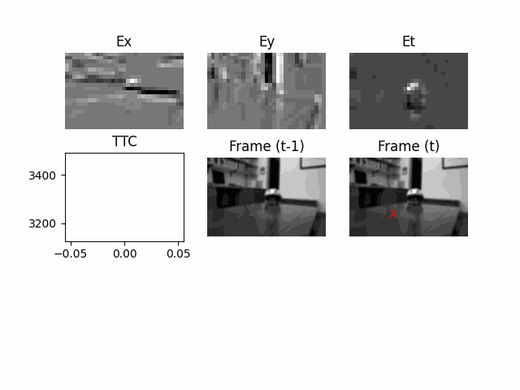

Time-to-contact.py
==

# Introduction
TODO

# Install
## Install requirements
```pip install -r requirement.txt```

## Install the ```py-ttc```
```pip install -e .```

# Usage
## Download testing videos
Link ```https://drive.google.com/drive/folders/1ZNo20v5BDV9Om93-GnjOTC0rQNGhpKAh?usp=sharing```

## Run the example scripts
```
python examples/run_ttc.py --src {video path} \
        --dst {logging path} \
        --dst-gif {gif logging path} \
        --vis --use-multiscale
```

## Example:
```
python examples/run_ttc.py --src Bike_Helmet.avi \
        --dst Bike_Helmet.csv \
        --dst-gif Bike_Helmet.gif \
        --vis --use-multiscale
```

